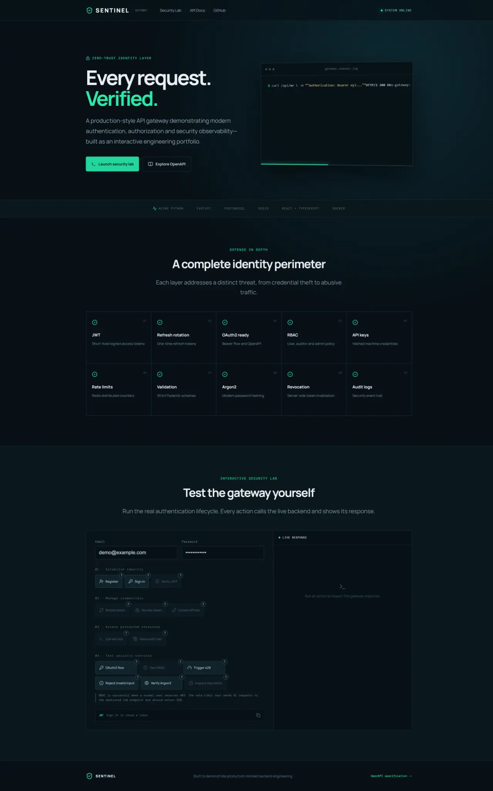

# Sentinel API Gateway & Authentication Service

A production-style identity gateway built to demonstrate backend engineering, application security, distributed infrastructure, and a polished developer experience. The live security lab lets visitors exercise the real authentication lifecycle and inspect every API response.

## Application preview

[](docs/images/application-preview.webp)

## Run in GitHub Codespaces

1. Select **Code → Codespaces → Create codespace on main**.
2. If Codespaces asks, select **I trust the authors**.
3. Wait while PostgreSQL, Redis, the backend, and the frontend are built and started.
4. At the end of startup, the terminal prints the frontend URL under **OPEN THE FRONTEND**. Hold Ctrl (or Cmd on macOS) and select the link.

Codespaces does not open the application automatically. If startup completed before the visible terminal was ready and you cannot see the link, use either method below:

- Open the **Ports** tab, find port **8000** labelled **Sentinel Gateway**, then select its globe/open-browser icon.
- Run `bash .devcontainer/start.sh`. This checks the application and prints the frontend URL again without rebuilding it.

No local configuration is required in Codespaces.

For local use, install Docker with Docker Compose, run `docker compose up --build`, and open [http://localhost:8000](http://localhost:8000). Copy `.env.example` to `.env` only when you want to override the documented development defaults. Never use those defaults for a public deployment.

## What it demonstrates

- JWT access tokens with explicit expiration
- Rotating, server-stored refresh tokens and revocation
- OAuth2-compatible bearer authentication and interactive OpenAPI
- Role-based authorization (user, auditor, admin)
- Hashed API keys for service-to-service access
- Distributed Redis rate limiting
- Pydantic request validation and safe response models
- Argon2 password hashing
- Persistent security audit logs
- Async FastAPI, SQLAlchemy, PostgreSQL, React, TypeScript, Docker, CI

## Key engineering decisions

- **Use short-lived access tokens and rotating refresh tokens:** access checks remain stateless while refresh-token records support reuse detection and explicit revocation.
- **Store only credential hashes:** passwords use Argon2, and API keys and refresh tokens are compared through protected representations rather than retained as plaintext.
- **Centralize authorization dependencies:** authentication, role checks, and service-key validation are enforced at the FastAPI boundary instead of being repeated inside handlers.
- **Share rate-limit state through Redis:** limits remain consistent across multiple API instances rather than resetting independently in process memory.
- **Persist security events:** audit records make authentication and administrative actions inspectable without exposing secret values.

## Trade-offs

- JWT access tokens remain valid until their short expiration unless every request performs a server-side revocation lookup.
- Rotating refresh tokens improve session security but add database state, cleanup, and race-condition handling.
- Redis-backed rate limiting works across replicas but introduces an infrastructure dependency for protected requests.
- The built-in identity flow makes the controls demonstrable; a production organization may delegate federation and account recovery to a dedicated identity provider.

## Documentation

| Guide | Contents |
|---|---|
| [Architecture](docs/ARCHITECTURE.md) | Components, request flow, data model, design decisions |
| [Security](docs/SECURITY.md) | Threat model and every implemented control |
| [API guide](docs/API.md) | Endpoints and example request flows |
| [Development](docs/DEVELOPMENT.md) | Local setup, testing, CI, project structure |

Interactive API documentation is available at `/api/docs` while the project is running.

## Verify the project

GitHub Actions checks Python imports, backend tests and coverage, TypeScript, the production frontend build, and the final Docker image on every push and pull request. Run the same core checks locally with:

```bash
ruff check app tests --select F
pytest --cov=app
cd frontend && npm run lint && npm run build
```

## Important scope note

This is a portfolio reference implementation, not a drop-in identity provider. Production deployments should use managed secrets, TLS at the edge, database migrations, a dedicated OAuth provider, monitoring/alerting, and organization-specific security review.

## License

[MIT](LICENSE)

