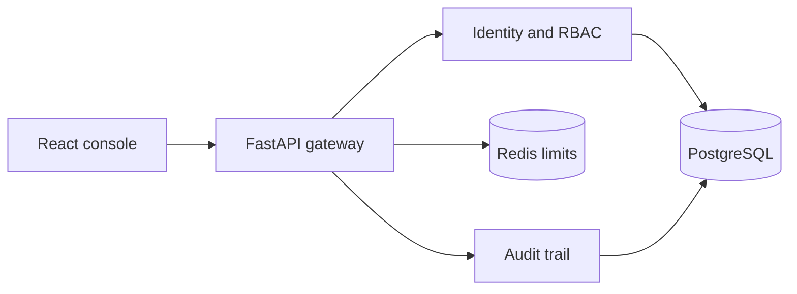

# Architecture

Sentinel uses a modular monolith for an intentionally focused portfolio scope. Its boundaries—gateway middleware, identity, policy, credentials, audit, and UI—can later become independent services without adding premature network complexity.

## Request path

1. Gateway middleware applies rate limiting and security headers.
2. Pydantic validates untrusted input before business logic runs.
3. Authentication resolves a JWT or hashed API key to an active identity.
4. RBAC dependencies enforce endpoint policy.
5. Relevant security activity is written to the audit trail.
6. Explicit response schemas prevent accidental data disclosure.

## Why these technologies

- **FastAPI + async SQLAlchemy:** typed APIs and non-blocking I/O.
- **PostgreSQL:** durable identities, token state, keys, and audit records.
- **Redis:** shared counters work across multiple gateway replicas.
- **React + TypeScript:** a maintainable interactive security console.
- **Docker Compose:** reproducible application and infrastructure startup.

